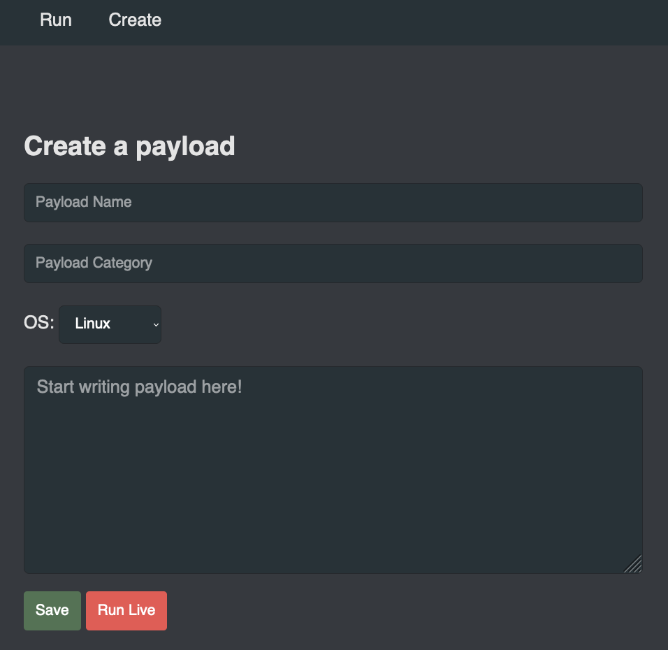

# Live Control
Run Commands live

The USB Nugget supports live command both through a web interface and via a web API.

## Web Interface
To access the web interface and run payloads live, connect to the USB Nugget’s Wi-Fi access point and visit the [creation page](http://192.168.4.1/create.html).



From this page, you can create, run, and save payloads to your USB Nugget.

## Python Script
If you want to use a script to send CatScratch commands or files to your USB Nugget, the following scripts will help you get started.

The following simple Python script can be used to send individual CatScratch commands from your computer while connected to the RubberNugget’s Wi-Fi network.

```python
import requests, base64
url = 'http://192.168.4.1/runlive.php'
while True:
    pew = input("Enter command:\n")
    try: requests.post(url, base64.b64encode(pew.encode()))
    except: print("Sent")
```

If you want to sent entire CatScratch payloads, you can use the following short script to send .TXT files.

```python
import requests, base64
url = 'http://192.168.4.1/runlive.php'

while True:
    pew = input("Enter path to CatScratch File:\n")
    file = open(pew, "r")
    payload = file.read()
    try: requests.post(url, base64.b64encode(payload.encode()))
    except: pew = input("Sent, press enter to send another:\n")
```