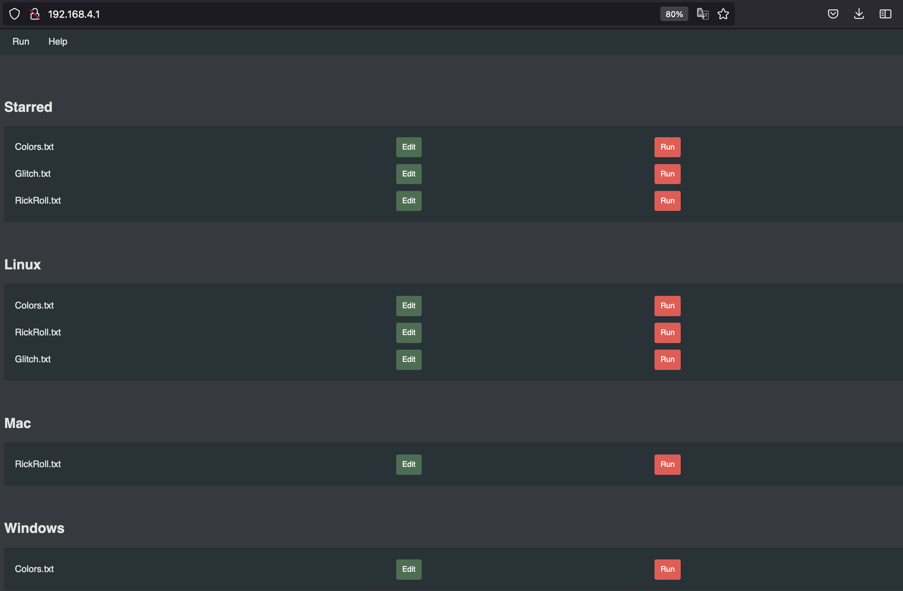

# Wi-Fi Interface
Connect to your Nugget from any browser

The USB Nugget creates a Wi-Fi interface that enables remote access. Accessing it is easy!

1. Locate the `RubberNugget` Wi-Fi Network
2. Connect with the password `nugget123`
3. Once connected, navigate to `192.168.4.1` in a browser
4. You’re connected! You can edit, run, and delete payloads from your browser.
