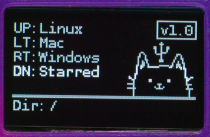
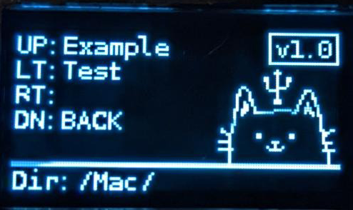
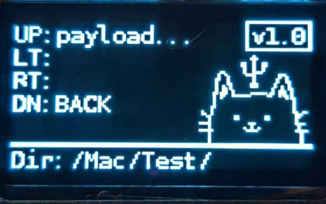
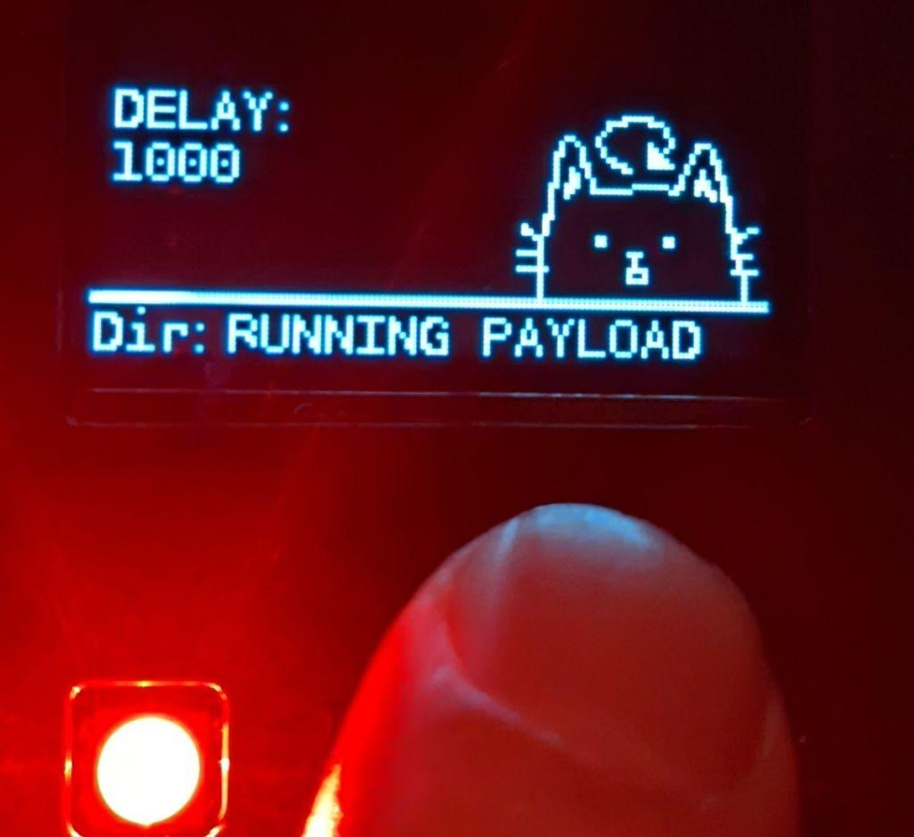

# Loading Payloads on the Nugget
Adding payloads via the USB and web interface

The USB Nugget supports adding payloads both through the web interface and directly over USB.

To start, let’s write a simple CatScratch payload and save it over USB.

## Write & Save a Simple Script
In your word processor of choice, write out a simple script and save it a plain .TXT file

```plaintext
GUI SPACE
WAIT 100
TYPE Terminal
ENTER
WAIT 1000
TYPE curl parrot.live
ENTER
```

## Plug in USB Nugget
Once you’ve plugged in your USB Nugget with a USB type C cable that supports data transfer, it should appear on your computer as a flash drive.

The Nugget comes preloaded with 4 different folders to cover 3 operating systems and frequently used payloads:
- Linux
- Mac
- Windows
- Starred Payloads

You can re-name these folders if you wish.

## Drag & Drop Payload to the Nugget
We’ll drop our payload in a “Test” folder under the “Mac” operating system folder. The file structure will look like this:

USB Nugget Drive → Mac Folder → Test Folder → Payload.TXT

Once we drop our file onto the Nugget, we can see it by pressing the left button for the Mac folder, then selecting the “Test” folder.



## Select & Run Payload

Next, we select the “Test” folder we just made by pressing the left button.


Inside the "Test" folder, we should see our payload.TXT!

We can run our payload by pressing the up button.



When the payload starts executing, the LED will turn red.

You can watch each command execute on the built-in screen while the payload runs.



That’s it! We’ve created a test payload and run it on the USB Nugget using the USB interface.
