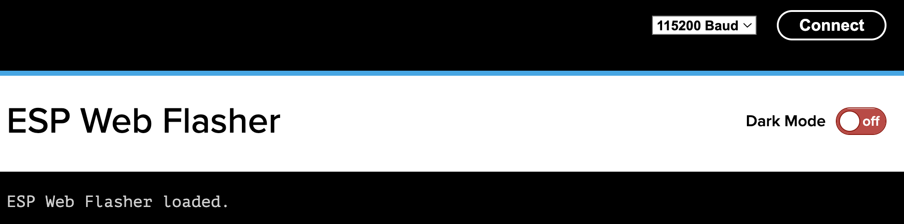

# Update Your USB Nugget with Chrome Browser
Flash your RubberNugget with the latest firmware

!!! note "Update First"
    The USB Nugget is updated frequently. Get the latest version to ensure you have access to new features & bug fixes!

Before you start hacking with your USB Nugget, make sure to update it to the latest firmware.

To update your USB Nugget, you will need:

- A USB type C cable that supports data 
- The [Google Chrome](https://www.google.com/chrome) web browser 
- The latest USB Nugget firmware .BIN file

## Flashing Via Chrome Browser
The easiest way to flash your USB Nugget is via the Chrome web browser. First, remove any case and unplug your Nugget.

**Step 1:** Visit the release page & download the most recent .BIN file.

**Step 2:** On the back of your Nugget, locate the “0” button & hold it down.

 
**Step 3:** Plug the Nugget into your computer with a USB cable & then release the “0” button.\

This puts the nugget into flashing mode.

If you have issues with step 5, try holding down the “0” button, tapping the “RST” button, and then releasing the “0” button to enter flashing mode instead.

**Step 4:** In a Chrome browser window, navigate to https://nabucasa.github.io/esp-web-flasher/
!!! warning "WebSerial Support"
    Currently, Firefox and other browsers do not support WebSerial.

**Step 5:** Click the “Connect” button & select the “ESP32-S2”/"ESP32-S3" board.

**Step 6:** Once connected, click "Erase" & confirm.

**Step 7:** After erasing the nugget has finished, click “Choose a file” & select the .BIN file from step 1.

## Your Nugget is ready to hack!
Plug in your USB Nugget and watch it mount as a flash drive. You can open the drive to explore preinstalled payloads and begin to add your own.

You can also connect via the web interface and run payloads from any device! The network name is `RubberNugget` and the password is `nugget123` to connect. Once connected, navigate to `192.168.4.1` in a browser.
