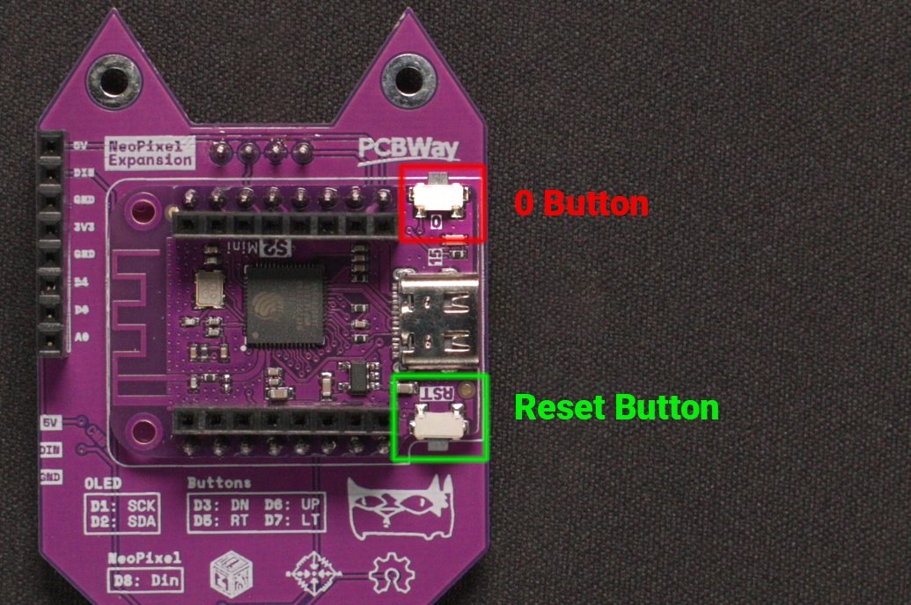

#  Update Your USB Nugget with ESPtool
Flash your RubberNugget via the command line

!!! note "Update First"
    The USB Nugget is updated frequently. Get the latest version to ensure you have access to new features & bug fixes!

If you’re more comfortable in the command line (or just hate using Chrome), you can also update your nugget using [ESPtool](https://github.com/espressif/esptool).

## Flashing via ESPTool

**Step 1:** Visit the [flashing site](https://nugget.dev/) & download the most recent .BIN file.

**Step 2:** On the back of your Nugget, locate the “0” button & hold it down.


**Step 3:** Plug the Nugget into your computer with a USB cable & then release the “0” button.

This puts the nugget into flashing mode. If you have issues with step 5, try holding down the “0” button, tapping the “RST” button, and then releasing the “0” button to enter flashing mode instead.


**Step 4:** Finding the Serial Port that your USB Nugget is connected to.
## Finding the Serial Port

Run the command below to erase the flash of your Nugget

=== "Windows"

    Found via the Device Manager

=== "macOS"

    ```bash
    ls /dev/cu.*
    ```

=== "Linux"

    ```bash
    ls /dev/tty*
    ```

**Step 5:** Erase the flash memory of your Nugget.
## Erase the Flash Memory

!!! note "Note"
    Make sure to replace `SERIAL_PORT` with the serial port of your Nugget.

=== "Windows"

    ```bash
    esptool --chip esp32s2 -p SERIAL_PORT erase_flash
    ```

=== "macOS & Linux"

    ```bash
    esptool.py --chip esp32s2 -p SERIAL_PORT erase_flash
    ```

## Flashing the new .BIN file
After erasing is complete, run the following command, making sure to replace `SERIAL_PORT` with the port your Nugget is on, and UPDATE.BIN with the update file.

=== "Windows"

    ```bash
    esptool --chip esp32s2 -p SERIAL_PORT write_flash -z 0x1000 UPDATE.BIN
    ```
=== "macOS & Linux"

    ```bash
    esptool.py --chip esp32s2 -p SERIAL_PORT write_flash -z 0x1000 UPDATE.BIN
    ```

Once flashing is finished, unplug your Nugget to complete the update.

## Your Nugget is ready to hack!
Plug in your USB Nugget and watch it mount as a flash drive. You can open the drive to explore preinstalled payloads and begin to add your own.

You can also connect via the web interface and run payloads from any device! The network name is `RubberNugget` and the password is `nugget123` to connect. Once connected, navigate to `192.168.4.1` in a browser.
