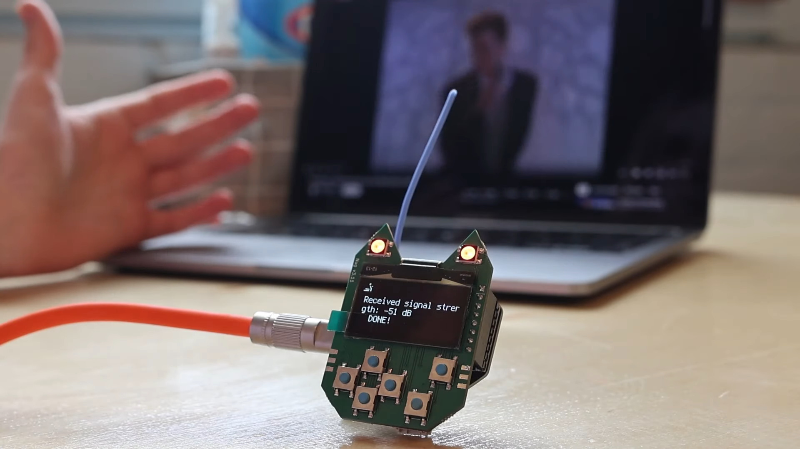

# Writing Your First Payload
Making CatScratch payloads on the USB Nugget

The USB Nugget supports CatScratch, making it easy to create your first payload!

If you need inspiration, you can find a list of payloads on the [Hak5 GitHub repository](https://github.com/hak5/usbrubberducky-payloads), which can be converted to CatScratch with our converter tool.

To get started, let’s review the full list of CatScratch commands the USB Nugget supports.

## CatScratch Payload Structure
When writing a CatScratch payload, commands are executed line by line. It’s also possible to press multiple keys at the same time by putting commands on the same line!

To write out a piece of text, type `TYPE` in all caps. See the example below for how this works:

| Command    | Result                            |
|------------|-----------------------------------|
| SHIFT C    | Press the Shift key and the c key |
| TYPE Hello | Type out the word “Hello”         |
| ALT F4     | Press the Alt key and the F4 key  |

## Built-in Commands
Now that we have the basics down, let’s take a look at supported commands:

| Command       | Usage               | Description                                                  |
|---------------|---------------------|--------------------------------------------------------------|
| `//`          | `// [ANY]`          | Comments are ignored by the interpreter                      |
| `DEFAULTWAIT` | `DEFAULTWAIT [INT]` | Sets the default time in ms between each command             |
| `WAIT`        | `WAIT [INT]`        | Sets a one-time delay in ms                                  |
| `TYPE`        | `TYPE [STR]`        | Types whatever string follows the command                    |
| `LED`         | `LED [CHAR]`        | Changes the color of the built-in Neopixel                   |
| `SCREEN`      | `SCREEN [STR]`      | Displays the string after the command on the Nugget’s screen |

## Supported LED Colors
The USB Nugget supports the following LED colors:

| Code | Color   |
|------|---------|
| `R`  | Red     |
| `G`  | Green   |
| `B`  | Blue    |
| `Y`  | Yellow  |
| `M`  | Magenta |
| `C`  | Cyan    |
| `W`  | White   |

## Supported Keys
Most standard keys are supported by the USB Nugget.

| Key                   |
|-----------------------|
| `a-z`                 | 
| `A-Z`                 |
| `0-9`                 |
| `F1-F12`              |
| `!@#$%^&*()_-=+`, etc |

## Modifier Keys
Keys like `SHIFT`, `ALT`, and the `WINDOWS`/`GUI` key can be useful for accessing hotkey combinations, and are frequently used in combination key presses.

| Key                   |
|-----------------------|
| `CTRL`/`CONTROL`      | 
| `SHIFT`               |
| `ALT`                 |
| `WINDOWS`/`CMD`/`GUI` |

## Other Useful Keys
Virtually anything you can do behind a keyboard can be recreated with the right keypresses. The following keys are essential to trigger keyboard shortcuts and navigate without a mouse.

| Key             |
|-----------------|
| `ENTER`         |
| `MENU`/`APP`    |
| `DELETE`        |
| `HOME`          |
| `INSERT`        |
| `PAGEUP`        |
| `PAGEDOWN`      |
| `UP`            |
| `DOWN`          |
| `LEFT`          |
| `RIGHT`         |
| `TAB`           |
| `ESC`           |
| `SPACE`         |
| `BACKSPACE`     |
| `END`           |
| `CAPSLOCK`      |
| `SCROLLLOCK`    |
| `NUMLOCK`       |
| `PRINTSCREEN`   |
| `PAUSE`/`BREAK` |

Now that we’ve gone over the supported CatScratch commands, let’s load and deploy a payload to the USB Nugget.