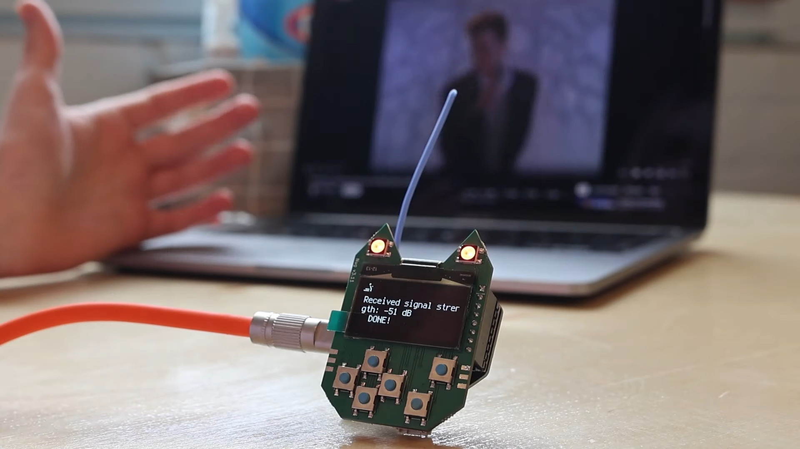

# Writing Your First Payload
Making CatScratch payloads on the USB Nugget



The USB Nugget supports CatScratch, making it easy to create your first payload!

If you need inspiration, you can find a list of payloads on the [Hak5 GitHub repository](https://github.com/hak5/usbrubberducky-payloads), which can be converted to CatScratch with our converter tool.

To get started, let’s review the full list of CatScratch commands the USB Nugget supports.

## CatScratch Payload Structure
When writing a CatScratch payload, commands are executed line by line. It’s also possible to press multiple keys at the same time by putting commands on the same line!

To write out a piece of text, type `TYPE` (or `STRING`) in all caps. See the example below for how this works:

| Command    | Result                            |
|------------|-----------------------------------|
| SHIFT C    | Press the Shift key and the c key |
| TYPE Hello | Type out the word “Hello”         |
| ALT F4     | Press the Alt key and the F4 key  |

To stop a payload while it’s running, **hold the B button** on the Nugget.

## Built-in Commands
Now that we have the basics down, let’s take a look at supported commands:

| Command                  | Usage               | Description                                                       |
|--------------------------|---------------------|-------------------------------------------------------------------|
| `//` / `REM`             | `// [ANY]`          | Comments — ignored by the interpreter                             |
| `TYPE` / `STRING`        | `TYPE [STR]`        | Types whatever string follows the command                         |
| `STRINGLN`               | `STRINGLN [STR]`    | Types the string and then presses Enter                           |
| `WAIT` / `DELAY`         | `WAIT [INT]`        | Sets a one-time delay in ms                                       |
| `DEFAULTWAIT`            | `DEFAULTWAIT [INT]` | Sets the default time in ms between each command                  |
| `LED`                    | `LED [CHAR]`        | Changes the color of the built-in Neopixel                        |
| `SCREEN`                 | `SCREEN [STR]`      | Displays the string after the command on the Nugget’s screen      |
| `LOCALE`                 | `LOCALE [STR]`      | Sets the keyboard layout (e.g. `US`)                              |

## Mouse Commands
The USB Nugget can act as a mouse as well as a keyboard:

| Command        | Usage                  | Description                                              |
|----------------|------------------------|---------------------------------------------------------|
| `MOUSE_MOVE`   | `MOUSE_MOVE [X] [Y]`   | Moves the cursor by X, Y pixels (relative to where it is)|
| `MOUSE_CLICK`  | `MOUSE_CLICK [L/R/M]`  | Clicks Left (default), Right, or Middle                  |
| `MOUSE_DOUBLE` | `MOUSE_DOUBLE`         | Double-clicks (left button)                              |
| `MOUSE_SCROLL` | `MOUSE_SCROLL [INT]`   | Scrolls up (positive) or down (negative)                 |
| `JIGGLE`       | `JIGGLE`               | Nudges the cursor — handy for keeping a machine awake    |

## Loops and Repeats
Repeat commands without copy-pasting them:

| Command             | Usage                       | Description                                                                 |
|---------------------|-----------------------------|-----------------------------------------------------------------------------|
| `REPEAT`            | `REPEAT [INT]`              | Repeats the **previous line** the given number of times                     |
| `LOOP` / `ENDLOOP`  | `LOOP [INT]` … `ENDLOOP`    | Repeats every line between `LOOP` and `ENDLOOP`. Loops can be nested.        |

If you leave off `ENDLOOP`, the loop simply repeats everything after it to the end of the payload.

```
LOOP 3
  TYPE meow
  ENTER
ENDLOOP
```

## OS Detection
The Nugget detects the host operating system, so one payload can behave differently on Windows, macOS, and Linux.

| Command                       | Usage                                | Description                                                                                          |
|-------------------------------|--------------------------------------|------------------------------------------------------------------------------------------------------|
| `IF_OS` / `ELSE` / `END_IF`   | `IF_OS [NAME]` … `ELSE` … `END_IF`   | Runs a block only on the matching OS. `NAME` is `WINDOWS`, `MACOS`, or `LINUX` (`WIN`, `MAC`, `OSX` also work). Single level — not nested. |
| `$_OS`                        | `TYPE $_OS`                          | A token replaced with the detected OS name (`WINDOWS`/`MACOS`/`LINUX`) when the payload runs          |

```
IF_OS WINDOWS
  GUI r
  WAIT 500
  STRINGLN notepad
ELSE
  TYPE This is not Windows
END_IF
```

## Supported LED Colors
The USB Nugget supports the following LED colors:

| Code | Color   |
|------|---------|
| `R`  | Red     |
| `G`  | Green   |
| `B`  | Blue    |
| `Y`  | Yellow  |
| `M`  | Magenta |
| `C`  | Cyan    |
| `W`  | White   |

## Supported Keys
Most standard keys are supported by the USB Nugget.

| Key                   |
|-----------------------|
| `a-z`                 | 
| `A-Z`                 |
| `0-9`                 |
| `F1-F12`              |
| `!@#$%^&*()_-=+`, etc |

## Modifier Keys
Keys like `SHIFT`, `ALT`, and the `WINDOWS`/`GUI` key can be useful for accessing hotkey combinations, and are frequently used in combination key presses.

| Key                   |
|-----------------------|
| `CTRL`/`CONTROL`      | 
| `SHIFT`               |
| `ALT`                 |
| `WINDOWS`/`CMD`/`GUI` |


## Other Useful Keys
Virtually anything you can do behind a keyboard can be recreated with the right keypresses. The following keys are essential to trigger keyboard shortcuts and navigate without a mouse.

| Key             |
|-----------------|
| `ENTER`         |
| `MENU`/`APP`    |
| `DELETE`        |
| `HOME`          |
| `INSERT`        |
| `PAGEUP`        |
| `PAGEDOWN`      |
| `UP`            |
| `DOWN`          |
| `LEFT`          |
| `RIGHT`         |
| `TAB`           |
| `ESC`           |
| `SPACE`         |
| `BACKSPACE`     |
| `END`           |
| `CAPSLOCK`      |
| `SCROLLLOCK`    |
| `NUMLOCK`       |
| `PRINTSCREEN`   |
| `PAUSE`/`BREAK` |

## Example Payloads
A few complete payloads to get you started:

**Type a greeting**
```
SCREEN Hello!
LED G
TYPE Hello from the Nugget!
```

**Keep a machine awake (mouse jiggler)**
```
SCREEN Jiggling...
LOOP 100
  JIGGLE
  WAIT 1000
ENDLOOP
```

**Open a terminal, whatever the OS**
```
IF_OS WINDOWS
  GUI r
  WAIT 500
  STRINGLN powershell
END_IF
IF_OS MACOS
  GUI SPACE
  WAIT 500
  STRINGLN terminal
  ENTER
END_IF
```

Now that we’ve gone over the supported CatScratch commands, let’s load and deploy a payload to the USB Nugget.
