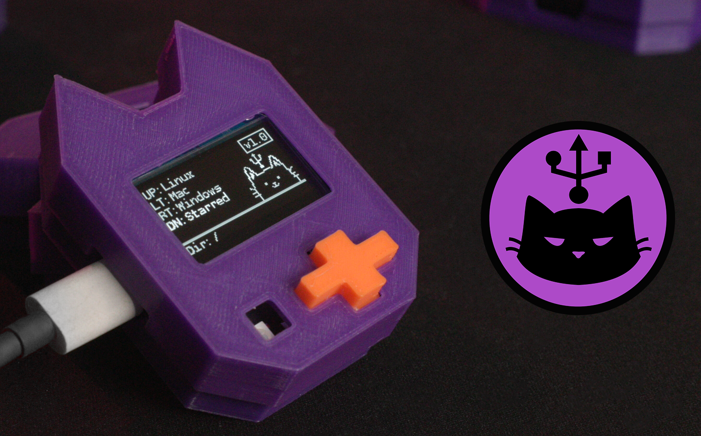
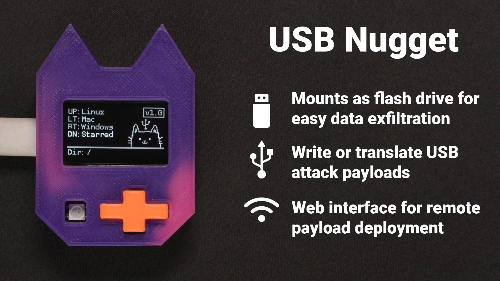

# USB Nugget

## What is the USB Nugget?
Meet the USB Nugget - an ESP32S2-powered, cat-shaped USB attack platform!

The USB Nugget is a cute, powerful HID attack platform that features a screen, buttons, and Wi-Fi support for flexible payload deployment created by Retia LLC, the team behind Null Byte and the Retia show on Hak5.

Run and edit payloads over Wi-Fi from mobile and desktop devices, or use the quick-select menu to launch payloads at the press of a button. Watch each command execute in real time on the built-in screen, and get instant feedback on your attack from the built-in LED.

The USB Nugget mounts as a USB flash drive when plugged into your computer, making it easy to drag and drop multiple payloads to the onboard storage.

